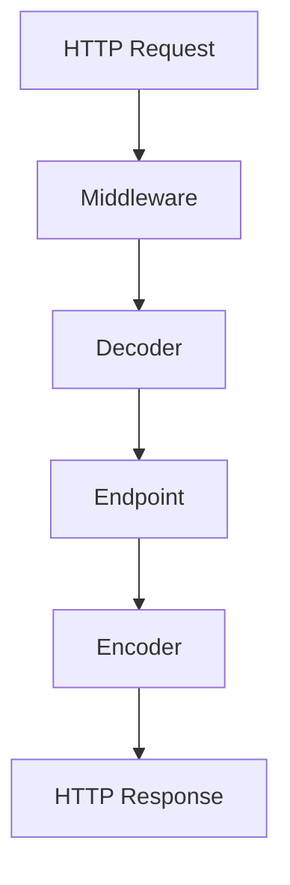

# 📘 Understanding Go-Kit Execution Flow

A Beginner-Friendly Guide

## 📑 Table of Contents

1. [What You Write vs What Go-Kit Does](#1-what-you-write-vs-what-go-kit-does)
2. [Go-Kit’s Fixed Internal Execution Workflow](#2-go-kits-fixed-internal-execution-workflow)
3. [Why It Feels Complex](#3-why-it-feels-complex)
4. [Core Idea — Inversion of Control (IoC)](#4-core-idea--inversion-of-control-ioc)
5. [Visual Breakdown](#5-visual-breakdown)
6. [Why Go-Kit Designs It This Way](#6-why-go-kit-designs-it-this-way)
7. [Go-Kit vs Router Frameworks](#7-go-kit-vs-router-frameworks)
8. [Full Execution Example](#8-full-execution-example)
9. [Summary](#9-summary)

---

## 1. What You Write vs What Go-Kit Does

### You Write (Argument Order)

```go
httptransport.NewServer(
    endpoints.CreateUserEndpoint,      // 1st: endpoint
    decodeCreateUserRequest,           // 2nd: decoder
    httptransport.EncodeJSONResponse,  // 3rd: encoder
    options...,                        // 4th+: middleware/options
)
```

This only tells Go-Kit what each component is — **not when to run them**.

---

## 2. Go-Kit’s Fixed Internal Execution Workflow

Inside `ServeHTTP`, Go-Kit always executes:

1. **Middleware** (before funcs)
2. **Decoder**
3. **Endpoint**
4. **Encoder**

This order **never changes**.

You supply the components → Go-Kit inserts them into its internal pipeline.

---

## 3. Why It Feels Complex

Go-Kit may feel confusing because:

❌ The real workflow is hidden inside the framework  
❌ You pass things in a different order than they execute  
❌ You don’t write the flow  

✔ **Go-Kit writes the flow for you**

You're providing ingredients — Go-Kit is doing the cooking.

---

## 4. Core Idea — Inversion of Control (IoC)

The most important concept:

> **You do NOT control the flow.**  
> **The framework controls the flow.**

### Your responsibility → Provide components
* Endpoint
* Decoder
* Encoder
* Middleware

### Go-Kit’s responsibility → Run everything in the correct order
`middleware → decoder → endpoint → encoder`

---

## 5. Visual Breakdown

### You Provide:

| Position | Component | Example |
| :--- | :--- | :--- |
| 1 | Endpoint | `CreateUserEndpoint` |
| 2 | Decoder | `decodeCreateUserRequest` |
| 3 | Encoder | `EncodeJSONResponse` |
| 4+ | Middleware | `AuthMiddleware` |

### Go-Kit Executes (Fixed Order):



This pipeline **never changes**.

---

## 6. Why Go-Kit Designs It This Way

Go-Kit is built for:

✔ Microservices  
✔ High modularity  
✔ Strict separation of concerns  
✔ Replaceable components  
✔ Easy unit testing  

Thus it splits:

**Transport ↔ Endpoint ↔ Business Logic**

This keeps everything clean and interchangeable.

---

## 7. Go-Kit vs Router Frameworks

Go-Kit does **NOT** use:

🚫 Gin order  
🚫 Chi order  
🚫 Gorilla Mux order  

Instead:

✔ **Go-Kit has its own internal pipeline**

The router only:
1. Matches the URL
2. Forwards the request to Go-Kit’s handler

**Router does not control:**
* Middleware
* Decoder
* Endpoint
* Encoder
* Error handling

All of that belongs to Go-Kit.

---

## 8. Full Execution Example

```go
r.Get("/users", httptransport.NewServer(
    endpoint,
    decoder,
    encoder,
))
```

### Actual execution:

1. **Router Match**
2. **Go-Kit Handler**
3. **Middleware**
4. **Decoder**
5. **Endpoint** (e.g., `GetUserEndpoint`)
6. **Business Logic**
7. **Encoder**

---

## 9. Summary

* You pass components.
* Go-Kit decides execution order.
* Uses **Inversion of Control (IoC)**.
* Pipeline is always: `middleware → decoder → endpoint → encoder`.
* Router does **NOT** control execution steps.